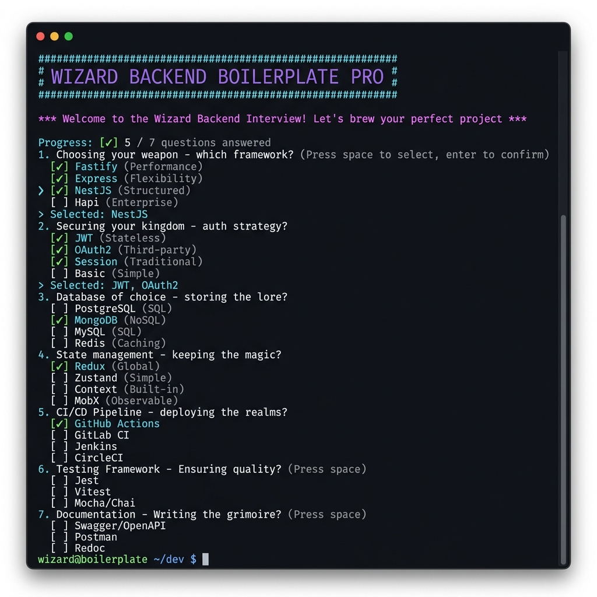
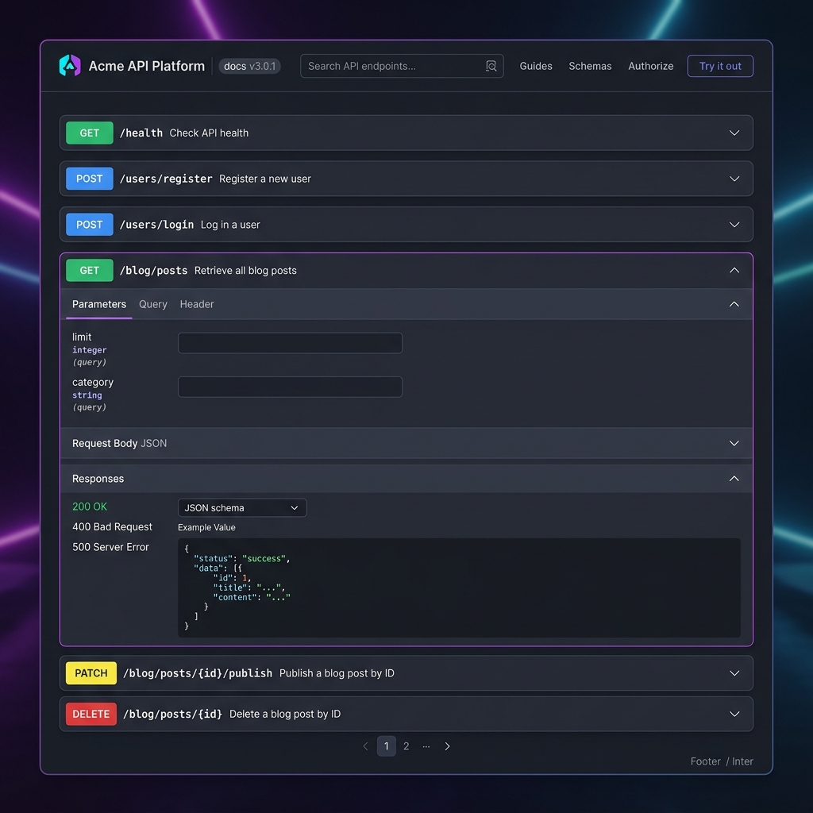

# Wizard Backend Boilerplate Pro

[](LICENSE)
[](https://github.com/ThisIsTheWizard/wizard-backend-boilerplate-pro-skill/actions/workflows/validate-templates.yml)
[](#compatibility)

A Claude Code skill that scaffolds production-ready backend APIs in minutes. Answer seven questions and get a fully wired API with authentication, database integration, structured logging, rate limiting, Swagger docs, and optional Docker — ready to run.

> **Try it now:** In Claude Code, just say: *"Create a new Express API called my-api with PostgreSQL and JWT"*



## Routes you get out of the box

```
GET    /health                  → { status, version, uptime, db }
GET    /docs                    → Swagger UI (OpenAPI 3.0)

POST   /users/register          → { data: { user, access_token, refresh_token } }
POST   /users/login             → { data: { user, access_token, refresh_token } }
POST   /users/refresh-token     → new token pair
POST   /users/forgot-password   → sends OTP email (always 200)
POST   /users/verify-forgot-password → resets password
GET    /users/me          🔒    → { data: { user, roles, permissions } }
POST   /users/logout      🔒    → revokes token
GET    /users             🔒    → paginated user list
GET    /users/:id         🔒    → get user
PUT    /users/:id         🔒    → update user

GET    /blog/posts              → paginated posts (filterable by status, search)
POST   /blog/posts        🔒    → create post
GET    /blog/posts/:id          → get post
PATCH  /blog/posts/:id/publish 🔒 → publish post
DELETE /blog/posts/:id    🔒    → archive post

─── with RBAC=yes ────────────────────────────────────────────────
GET    /roles             🔒    → list roles
GET    /permissions       🔒    → list permissions
POST   /role-users        🔒    → assign role to user
DELETE /role-users/:id    🔒    → remove role from user

─── with GRAPHQL=yes ─────────────────────────────────────────────
POST   /graphql                 → execute queries / mutations
GET    /graphql                 → Apollo Sandbox (dev)
```

🔒 = bearer token required



## What it builds

- **Up to 28 API modules** across 6 categories — 15 always-on + 4 real-time/cache (optional) + 4 Auth infrastructure (custom auth) + 4 RBAC (optional) + 1 GraphQL (optional)
- **OpenAPI / Swagger UI** at `/docs` — auto-generated from your routes
- **Working REST API** with health check, auth, users CRUD, pagination, file upload, WebSocket, SSE
- **Database integration** with the right ORM auto-wired for your framework + DB choice
- **Authentication** — JWT, API Key, or session-based, fully implemented with middleware
- **Optional Docker** — production-ready multi-stage `Dockerfile` + `docker-compose.yml`
- **Structured logging** with request IDs, timing, and error context
- **Environment config** — typed `.env` loading with validation

## Supported frameworks

### Node.js / TypeScript
| Framework | Character |
|---|---|
| **Express** | Classic, middleware-based, maximum flexibility |
| **Fastify** | High-performance, schema-first, 2× faster than Express |
| **NestJS** | Opinionated, decorator-based, enterprise-grade |
| **Hono** | Ultra-lightweight, edge-ready, runs anywhere |

### Python
| Framework | Character |
|---|---|
| **FastAPI** | Async, Pydantic-powered, OpenAPI native |
| **Django** | Batteries-included, Django REST Framework |
| **Flask** | Minimal, explicit, battle-tested |

### Go
| Framework | Character |
|---|---|
| **Gin** | High-performance, production-popular |
| **Echo** | Clean API, middleware-rich |

## ORM / ODM

The skill auto-selects the best ORM for your framework + database combination:

| Framework | SQL (PostgreSQL / MySQL / SQLite) | MongoDB |
|---|---|---|
| **Express** | **Sequelize** | Mongoose |
| **Fastify** | Prisma | Mongoose |
| **NestJS** | **Prisma** | Prisma (mongodb provider) |
| **Hono** | Drizzle | Mongoose |
| **FastAPI / Flask** | SQLAlchemy (async) | Motor |
| **Django** | Django ORM (built-in) | MongoEngine |
| **Gin / Echo** | GORM | mongo-driver |

You can override the default during the interview (Q2).

## The modules (up to 28)

| Category | Modules | Count |
|---|---|---|
| **Core** | HealthCheck, Config, Logger, ErrorHandler, CORS, RateLimit | 6 |
| **User + Auth** | UserAuth (register, login, refresh, me, logout, change-email, change-password, forgot-password) | 1 |
| **Blog** | BlogCRUD (REST or GraphQL) | 1 |
| **Data utilities** | Pagination, SearchFilter, FileUpload, FileDownload, WebhookReceiver | 5 |
| **Infrastructure** | DatabaseClient, CacheClient, Migrations, BackgroundJob | 4 |
| **Real-time** | WebSocketHub, ServerSentEvents, EventEmitter | 3 |
| **DX / Docs** | SwaggerDocs, RequestValidator, ResponseFormatter, TypedEnv | 4 |
| **Auth infrastructure** *(custom auth only)* | AuthToken, VerificationToken, AuthTemplate, Notification | +4 |
| **RBAC** *(custom auth + RBAC=yes)* | Role, Permission, RoleUser, RolePermission | +4 |
| **GraphQL** *(optional)* | GraphQLServer | +1 |

## Installation

### Claude Code
```bash
# Install from GitHub (once the repo is public)
claude install ThisIsTheWizard/wizard-backend-boilerplate-pro-skill
```

### Manual (any agent — Claude Code, Cursor, Windsurf, Codex, etc.)
```bash
git clone https://github.com/ThisIsTheWizard/wizard-backend-boilerplate-pro-skill
cd wizard-backend-boilerplate-pro-skill

# Claude Code — symlink into your skills directory
ln -s "$(pwd)/src/wizard-backend-boilerplate-pro" ~/.claude/skills/wizard-backend-boilerplate-pro

# Cursor / other agents — copy the skill folder into your project
cp -r src/wizard-backend-boilerplate-pro /path/to/your/project/.cursor/skills/
```

The skill is pure Markdown + shell scripts with no agent-specific syntax. It works wherever your agent can read files and run commands.

---

## Usage

The skill triggers automatically when you ask:

- "Create a new Express API"
- "Scaffold a FastAPI backend"
- "Set up a NestJS project with PostgreSQL and JWT"
- "New backend boilerplate with Gin and Docker"
- "Build a REST API with Flask and MongoDB"

### 30-second hello world

Once your API is scaffolded and running:
```bash
# Register a user
curl -s -X POST http://localhost:3000/users/register \
  -H "Content-Type: application/json" \
  -d '{"email":"you@example.com","password":"Wizard123!"}' | jq .

# Check the Swagger UI
open http://localhost:3000/docs
```

## Seven interview questions

1. **Framework** — choose from the 9 supported frameworks
2. **Database + ORM** — PostgreSQL, MySQL, MongoDB, SQLite, or None; ORM auto-selected with override allowed
3. **Auth strategy** — JWT, API Key, Session, better-auth, Clerk, Auth0, Supabase, or None
4. **Docker** — three environments (Dev/Prod/Test) or skip
5. **Project name** — required
6. **GraphQL** — add a `POST /graphql` endpoint alongside REST?
7. **RBAC** — roles, permissions, role-users, role-permissions tables + routes? *(only when AUTH is custom)*

Three values are auto-resolved — never asked:
- **ORM/ODM** — best choice for your framework + DB (override allowed)
- **Versions** — always latest stable
- **Package manager** — auto-detected from lockfile (Node.js projects)

## Compatibility

This skill uses only plain CommonMark Markdown. All actions are shell commands or file writes — no agent-specific tags or runtime APIs.

| Agent | Status |
|---|---|
| Claude Code | ✅ Primary target |
| Cursor Agent | ✅ Tested |
| Windsurf | ✅ Tested |
| Copilot Workspace | ✅ |
| Codex / OpenCode | ✅ |
| Gemini CLI | ✅ |
| Continue, RooCode, KiloCode, Kiro | ✅ |
| Trae, Warp, Augment, Aider | ✅ |

Any agent that can read Markdown files and execute shell commands will work.
